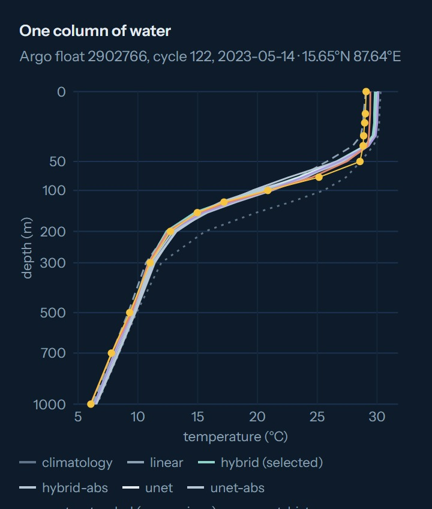
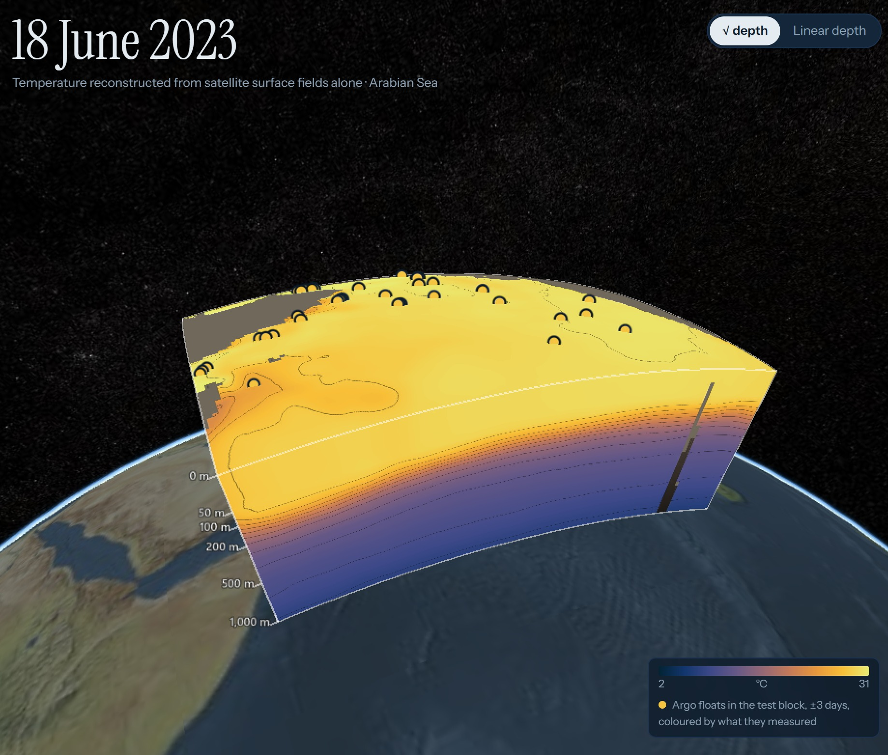
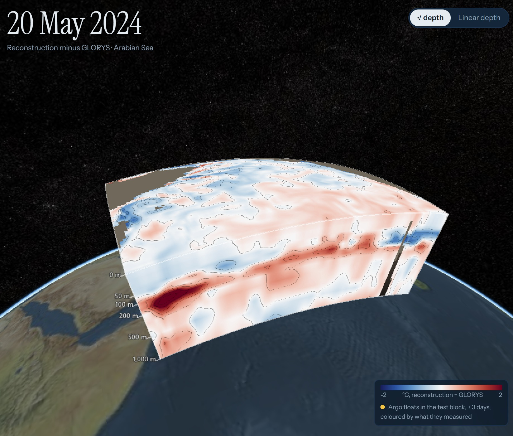
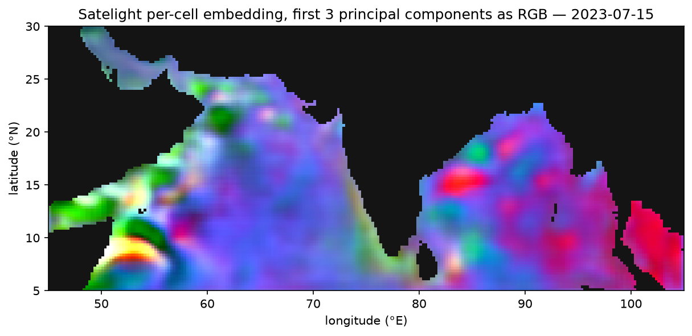
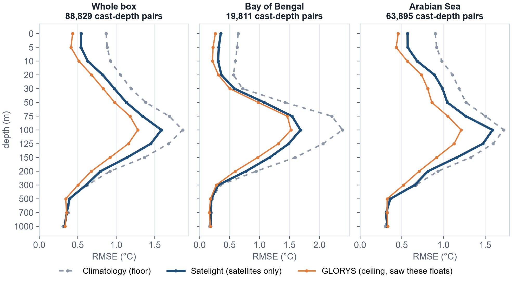

# Satelight — the ocean below, seen from space

SIH 2026 · Problem Statement 26066 · INCOIS / Ministry of Earth Sciences · Disaster Management

**Temperature from the surface down to 1,000 m, every day, at 0.25°, over the North Indian
Ocean, reconstructed from satellite surface observations alone.** Eight fields that
satellites see every day (sea surface temperature, salinity, sea level, currents and winds)
are compressed into a 32-number embedding per cell, and a second network decodes that
embedding into temperature at the 15 standard depths. Argo floats are not an input. They
are the judge: every score is measured against floats the model never saw, depth by depth
and basin by basin, beside climatology (the floor) and the GLORYS reanalysis (the ceiling).

## The viewer


| One column of water | The Arabian Sea |
|---|---|
|  |  |
| **Where it is wrong** | **The embedding** |
|  |  |

- **Surface in, 3D out.** The left panel shows the eight satellite fields for the chosen
  day and the embedding they were compressed into. The cube is the decoded temperature,
  0 to 1,000 m, over the Bay of Bengal, the Arabian Sea or the whole box.
- **Floats inside the water.** The held-out Argo casts of that week stand in the cube,
  coloured by what they measured. Click one for its profile against the reconstruction,
  GLORYS and climatology, always with its QC flag, data mode and source file.
- **Four fields, one colour bar.** Reconstruction, GLORYS, climatology, and the error
  (reconstruction minus GLORYS). Stretched or linear depth.
- **How close, at every depth.** The skill panel is RMSE against the floats, read from the
  harness output, never typed.
- **Honest about gaps.** A day with a missing input is announced, not filled. Cells
  shallower than a level are masked, never extrapolated.
- The URL carries the view, so a link opens the same scene.

## What it does

- **Pipeline.** One fetch per source, regridded onto one 0.25° lattice (240 × 100 cells,
  45–105°E, 5–30°N) as daily cubes, 2010–2024 and back to 1993. Every normalisation the
  ingest had to assume is recorded in the file's provenance and travels into the output.
  A re-fetch reproduces the stored cube bit for bit.
- **Embedding engine.** Two encoders, a U-Net and a CNN + transformer hybrid, map each
  day's surface to a 32-number vector per cell. The embedding is saved as a file and
  inspected: does it separate the monsoon seasons, and does it hold mixed-layer depth,
  which it was never trained on? Both are tested against controls that can make it fail.
- **Reconstruction.** A per-cell decoder gives temperature at 0, 5, 10, 20, 30, 50, 75, 100,
  125, 150, 200, 300, 500, 700 and 1,000 m, trained on GLORYS12. Nothing from GLORYS goes in
  as an input. Every run comes from a config file and a seed, and repeats bit for bit.
- **Output.** A CF-1.8 NetCDF per day on the common grid, with a manifest of skipped days.
- **Validation.** Contiguous time blocks (train 2010–2020, validation 2021–22, test
  2023–24). The model is chosen on the validation block alone. 6,144 Argo casts from the
  test block are scored at their own cell and day, per depth and per basin. INCOIS
  gridded Argo is scored too, and checked against the floats itself.
- **For cyclone forecasters.** The 20 °C and 26 °C isotherm depths and the tropical
  cyclone heat potential, scored against the floats. Cyclones Mocha and Biparjoy, both in
  the held-out years, as case studies of the cold wake.

## What the floats say

RMSE (°C) against held-out Argo casts, 2023–24. From `docs/13-eval-results.md`, where
every depth, every contender and the bias and correlation tables are.

| Depth | Bay of Bengal: climatology | Satelight | GLORYS | Arabian Sea: climatology | Satelight | GLORYS |
|---:|---:|---:|---:|---:|---:|---:|
| 0 m | 0.641 | 0.352 | 0.262 | 0.902 | 0.570 | 0.458 |
| 100 m | 2.385 | 1.683 | 1.525 | 1.723 | 1.589 | 1.212 |
| 300 m | 0.344 | 0.310 | 0.277 | 0.671 | 0.655 | 0.522 |
| 1,000 m | 0.167 | 0.185 | 0.179 | 0.302 | 0.324 | 0.331 |

- Satelight beats climatology from the surface to 300 m in both basins and stays behind
  GLORYS, which assimilated these same floats. From 500 to 700 m it is level with
  climatology, and at 1,000 m slightly worse.
- The thermocline (75–150 m) is the hard part. The error peaks there, and it runs warm.
- Tropical cyclone heat potential, RMSE in kJ/cm²: climatology 21.080, Satelight 13.695,
  GLORYS 13.522 in the Bay of Bengal; 20.582, 12.324 and 11.215 in the Arabian Sea.
- **Not met yet:** the embedding check (S4) is half met. One embedding holds mixed-layer
  depth better than the raw inputs, another separates the seasons better than the
  calendar, and no single one does both (`docs/02-requirements.md`).



## Run it

```
python -m venv .venv && .venv/Scripts/pip install -r requirements.txt   (Python 3.13)
python -m satelight.fetch static
python -m satelight.fetch all                   # resumable; long on a slow link
python -m satelight.argo --period test
python -m satelight.baselines                   # climatology + per-cell ridge
python -m satelight.train configs/hybrid.toml   # one file per run in configs/
python -m satelight.predict hybrid 2023-01-01 2024-12-15   # daily NetCDF + embeddings
python -m satelight.evaluate                    # writes docs/13-eval-results.md
python -m pytest tests                          # every module's self-check
```

One click: `start.bat` on Windows, `./start.sh` on macOS and Linux. Each builds the viewer
if needed, serves it with the API and opens http://127.0.0.1:8026.

Credentials: a free Copernicus Marine account in `.env`
(`COPERNICUSMARINE_SERVICE_USERNAME`, `COPERNICUSMARINE_SERVICE_PASSWORD`) and NASA
Earthdata in `~/.netrc`. Neither is in the repository. The INCOIS data needs none.

## Stack

PyTorch · xarray · NumPy · SciPy · scikit-learn · TEOS-10 (`gsw`) · Copernicus Marine
toolbox · earthaccess · FastAPI · CesiumJS · TypeScript · Vite · Remotion (the film).

## Data

Inputs, all satellite: OSTIA SST · MULTIOBS SSS · DUACS sea level (ADT, SLA) · OSCAR L4
currents · CCMP v3.1 winds. Target: GLORYS12 reanalysis. Validation: Argo core profiles via
ERDDAP (adjusted first, QC kept, rejected levels counted) and INCOIS gridded Argo via the
INCOIS ERDDAP. Every source is probed, not assumed: `docs/05-data-sources.md`.

## Documents

Start at `docs/00-start-here.md`. The official problem statement is in
`docs/01-problem-statement.md`, every requirement and its proof in
`docs/02-requirements.md`, the limits in `docs/03-limitations.md`, the method in
`docs/06-method.md`, every measured number in `docs/13-eval-results.md` (generated, never
hand-edited), what goes beyond the brief in `docs/14-novelties.md`, and what is knowingly
incomplete in `docs/11-deferred.md`.
